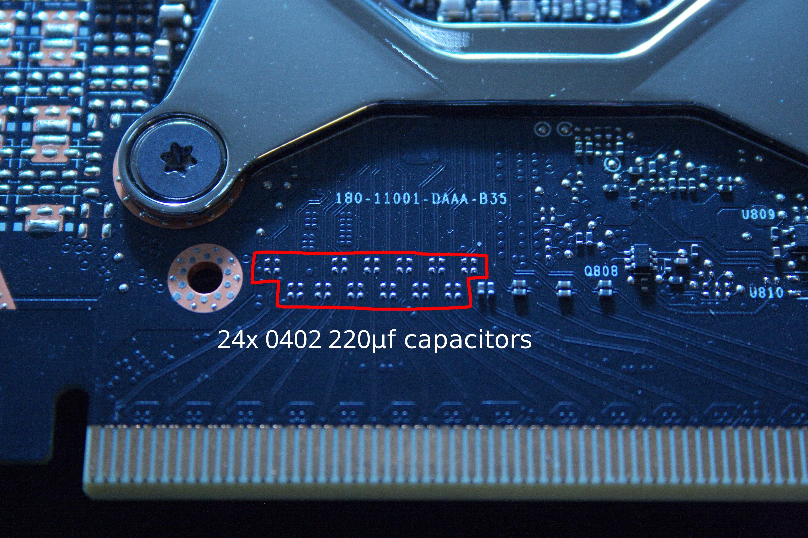
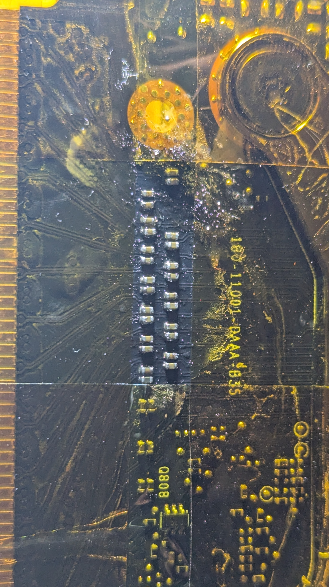

# PCIe Capacitor Mod

**PCIe Capacitor Mod**

The CMP 170HX has two independent PCIe bandwidth restrictions. This page documents the hardware-level fix for one of them: the missing AC coupling capacitors that limit the card to x4 lane width. **This modification has been confirmed working on the CMP 170HX** by Amogh Munikote in April 2026 — the first publicly documented success on this specific card.

**Understanding the Two Layers**

As documented in the PCB Analysis page, PCIe bandwidth is restricted in two independent ways:

**Layer 1 — Firmware speed lock:** The VBIOS enforces PCIe Gen 1 speed (2.5 GT/s) regardless of the host slot. This is a firmware-level restriction that cannot currently be removed due to Ampere VBIOS signing. After this mod, the card will still operate at Gen 1 speed.

**Layer 2 — PCB capacitor omission:** 12 of the 16 PCIe data lanes have their AC coupling capacitors physically missing from the PCB. These 0402 capacitors are required for valid differential signaling on each lane. Their absence forces the PCIe link to negotiate down to x4 width.

This mod addresses Layer 2 only. The result will be **PCIe Gen 1 x16 (\~4 GB/s)** instead of **PCIe Gen 1 x4 (\~1 GB/s)** — a 4× improvement in PCIe bandwidth.

<figure><figcaption></figcaption></figure>

**Why This Matters**

Current PCIe bandwidth (unmodified): \~0.85 GB/s After this mod: \~4 GB/s Full PCIe 4.0 x16 (not achievable without Layer 1 fix): \~64 GB/s

4 GB/s is still far below full PCIe bandwidth but is meaningful for workloads that do CPU-GPU data transfers, multi-GPU setups using PCIe, and any application where the current 0.85 GB/s is a bottleneck.

**Skill Requirements**

This modification requires:

* Proficiency with 0402 SMD soldering (these components are approximately 1.0mm × 0.5mm)
* Hot air rework station or very fine-tipped soldering iron
* Magnification (microscope or loupe recommended)
* Steady hands and patience

0402 components are considered small but workable by experienced hobbyists. If you have not soldered 0402 components before, practice on a dead PCB first.

**Required Components**

* **24× 0402 capacitors, 0.22µF (220nF)**, 16V or higher voltage rating, X7R dielectric
  * You need 2 capacitors per lane × 12 missing lanes = 24 capacitors total
  * **0.22µF is the value specified in the NVIDIA A100 GA100-883 reference schematic (P1001-B02, Page 3 — IO: PCIe CONNECTOR)** — this is the authoritative value direct from NVIDIA's own design
  * Order at least 30 to account for losses during 0402 soldering
  * **Confirmed working part:** Samsung CL05B224KO5NNNC — DigiKey part number 1276-1176-1-ND (CAP CER 0.22UF 16V X7R 0402)
  * Also available from Mouser, LCSC (cheapest), or equivalent X7R 0402 0.22µF from any manufacturer

**Reference Designators**

The capacitors in the schematic are labeled in the C1100–C1350 range (e.g. C1120, C1125, C1130, C1135 for each differential pair). Cross-reference these against your physical PCB to identify exactly which pads are empty on your card. The empty pads will have no component but visible copper pads — they are located along the PCIe lane routing between the connector gold fingers and the GPU die.

**Verification**

After completing the mod, verify with:

bash

```bash
sudo lspci -s 0000:21:00.0 -vvv | grep LnkSta
```

**Verified Results**

Confirmed by Amogh Munikote, April 2026. First publicly documented successful PCIe capacitor mod on the CMP 170HX.

Before:

```
LnkSta: Speed 2.5GT/s, Width x4 (downgraded)
LnkSta2: Current De-emphasis Level: -6dB, EqualizationComplete- EqualizationPhase1-
```

After:

```
LnkSta: Speed 2.5GT/s, Width x16
LnkSta2: Current De-emphasis Level: -6dB, EqualizationComplete- EqualizationPhase1-
```

The link width upgraded from x4 to x16 as expected. Speed remains at 2.5GT/s (Gen 1) due to the firmware-level Layer 1 lock which is a separate unsolved problem. PCIe bandwidth is now approximately 4 GB/s versus the previous \~0.85 GB/s — a 4× improvement.

**Status: ✅ CONFIRMED on CMP 170HX**

<figure><figcaption></figcaption></figure>

**Next Steps After This Mod**

With x16 width now confirmed working, the remaining PCIe bottleneck is the Gen 1 speed lock (Layer 1). See the Security & Firmware Research section for the current state of efforts to bypass this. The `nvapeek`/`nvapoke` register analysis at `0x14118f78` documented there is the most promising software-side avenue currently under investigation.

**If You've Done This Mod**

Submit your results including before/after `lspci` output and any PCIe bandwidth measurements to the community via GitHub. Your contribution will be added here.
